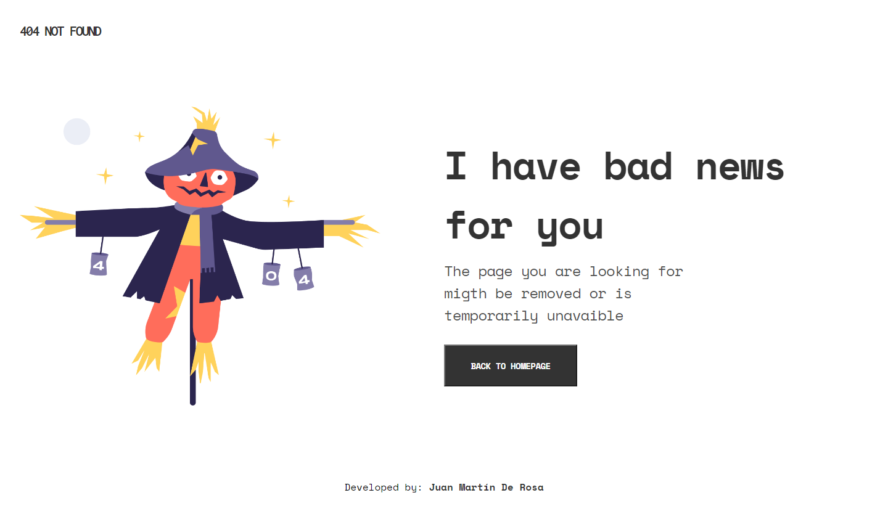
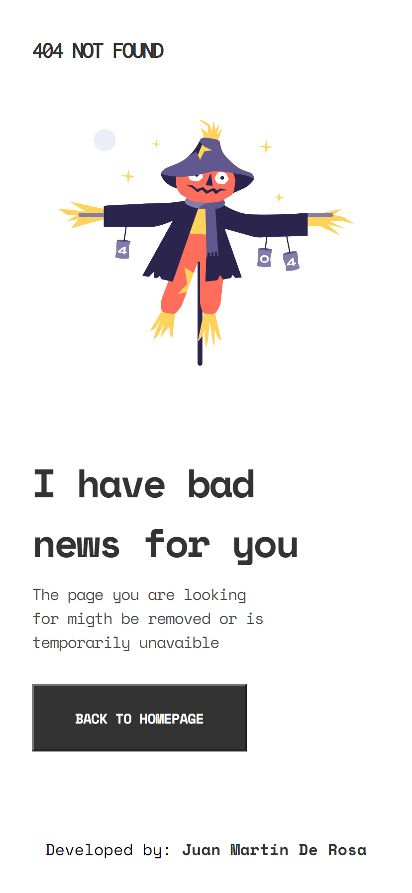

## Overview

You can see a live demo at:
[GitHub Pages](https://juanmderosa.github.io/404-notfound/)

### Built With

<!-- This section should list any major frameworks that you built your project using. Here are a few examples.-->

  -Semantic HTML
  -CSS
  -Flexbox
  -Responsive Design

## Features

<!-- List the features of your application or follow the template. Don't share the figma file here :) -->

This application/site was created as a submission to a [DevChallenges](https://devchallenges.io/challenges) challenge. The [challenge](https://devchallenges.io/challenges/wBunSb7FPrIepJZAg0sY) was to build an application to complete the given user stories.

## Contact

- Website [juanmderosa-developer](https://juanmderosa-developer.com/)
- GitHub [juanmderosa](https://github.com/juanmderosa/)
- Linkedin [Juan Martín De Rosa](https://www.linkedin.com/in/juanmderosa/)
